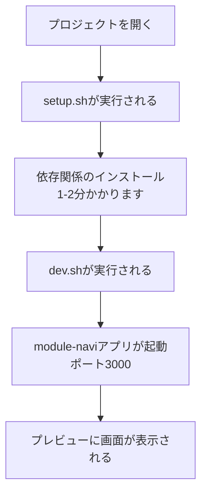
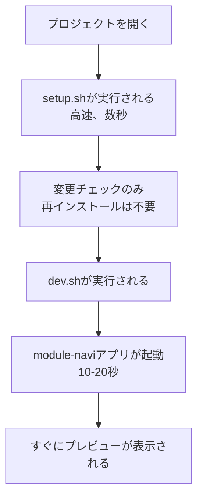

# Builder.io開発環境ガイド

このドキュメントは、Builder.io環境でこのプロジェクトを開発する際のガイドです。

## 📋 目次

1. [Builder.io開発環境とは](#builderio開発環境とは)
2. [自動起動の仕組み](#自動起動の仕組み)
3. [初回起動時の流れ](#初回起動時の流れ)
4. [プロジェクト構造](#プロジェクト構造)
5. [トラブルシューティング](#トラブルシューティング)
6. [手動設定が必要な場合](#手動設定が必要な場合)
7. [他のアプリを起動する方法](#他のアプリを起動する方法)
8. [よくある質問（FAQ）](#よくある質問faq)

---

## Builder.io開発環境とは

Builder.ioは**クラウド上で動作する開発環境**です。ローカル開発環境との違いは以下の通りです：

### Builder.io環境の特徴

| 特徴 | Builder.io | ローカル開発 |
|------|-----------|------------|
| 実行場所 | クラウド（Docker環境） | 自分のPC |
| 依存関係のインストール | 毎回必要（初回は1-2分） | 一度だけ |
| Git操作 | 自動commit、手動push | 手動 |
| プレビュー | iframe内で表示 | ブラウザで直接アクセス |
| 設定の保存 | クラウドに自動保存 | ローカルに保存 |

### Builder.io環境の利点

✅ **どこからでもアクセス可能** - インターネットがあればどこでも開発できます  
✅ **環境構築不要** - Node.js、pnpmなどのインストールが不要  
✅ **統一された環境** - 全員が同じ環境で開発できます  
✅ **リアルタイムプレビュー** - コード変更が即座に反映されます

---

## 自動起動の仕組み

Builder.ioでは、**DevServerControl**という仕組みで開発サーバーを管理しています。

### 設定内容（このプロジェクト）

このプロジェクトでは、以下の設定が**自動的に保存**されています：

| 設定項目 | 値 | 説明 |
|---------|-----|------|
| **Setup Command** | `HUSKY=0 corepack pnpm install` | 依存関係のインストール |
| **Dev Command** | `corepack pnpm --filter module-navi dev` | 開発サーバーの起動 |
| **Proxy Port** | `3000` | プレビューを表示するポート |

これらの設定は、以下のスクリプトファイルにも記録されています：

- **`.builder/setup.sh`** - セットアップスクリプト
- **`.builder/dev.sh`** - 開発サーバー起動スクリプト

### なぜHUSKY=0が必要なのか？

**Husky**は、Gitコミット時に自動的にスクリプトを実行するツールです。

```bash
HUSKY=0 corepack pnpm install
```

Builder.io環境では、`.git`ディレクトリが存在しない場合があるため、Huskyのセットアップがエラーになることがあります。`HUSKY=0`を設定することで、Huskyのインストールをスキップし、エラーを回避しています。

### なぜcorepackを使うのか？

**corepack**は、Node.jsに標準で組み込まれている機能で、pnpmを自動的に有効化します。

```bash
corepack pnpm install
```

これにより、pnpmをグローバルにインストールする必要がなくなります。

---

## 初回起動時の流れ

Builder.ioでプロジェクトを開いたときの流れを説明します。

### 1回目（初回起動時）



**所要時間**: 約2-3分

**ログ例**:
```
🔧 Builder.io環境のセットアップを開始します...
📦 pnpmを使用して依存関係をインストールします...
Progress: resolved 1686, reused 1686, downloaded 0, added 1686, done
✅ セットアップが完了しました！

🚀 module-naviアプリの開発サーバーを起動します...
📍 ポート: 3000
  ▲ Next.js 14.2.0
  - Local:        http://localhost:3000
  ✓ Ready in 15.2s
```

### 2回目以降



**所要時間**: 約30秒〜1分

---

## プロジェクト構造

このプロジェクトは**モノレポ**形式で管理されています。

### モノレポとは？

複数のアプリやライブラリを1つのリポジトリで管理する方法です。

```
sidekick/（プロジェクト全体）
├── .builder/              ← Builder.io設定ファイル（このフォルダ）
│   ├── setup.sh           ← セットアップスクリプト
│   ├── dev.sh             ← 開発サーバー起動スクリプト
│   └── README_JA.md       ← このドキュメント
├── apps/                  ← アプリケーション群
│   ├── module-navi/       ← ドキュメント表示アプリ（デフォルト起動）
│   └── documents/         ← ドキュメントアプリ
├── packages/              ← 共通ライブラリ群
│   ├── ecm/               ← ECMコンポーネントライブラリ
│   ├── scm/               ← SCMコンポーネントライブラリ
│   └── ...                ← その他のパッケージ
├── package.json           ← プロジェクト全体の設定
└── pnpm-workspace.yaml    ← モノレポ設定
```

### 各アプリの役割

| アプリ名 | ポート | 説明 |
|---------|--------|------|
| **module-navi** | 3000 | ECM/SCMコンポーネントのドキュメント表示（デフォルト） |
| **documents** | 3003 | プロジェクトドキュメント |
| **ecm (Storybook)** | 8080 | ECMコンポーネントのStorybook |
| **scm (Storybook)** | 8081 | SCMコンポーネントのStorybook |

---

## トラブルシューティング

### 問題1: 開発サーバーが起動しない

**症状**:
```
Dev server command is not configured
```

**解決策**:

1. **DevServerControlツール**を使用して設定を確認:
   ```
   Get Logs を実行
   ```

2. Dev Commandが設定されているか確認:
   ```
   corepack pnpm --filter module-navi dev
   ```

3. 設定されていない場合、手動で設定:
   ```
   Set Dev Command: corepack pnpm --filter module-navi dev
   Set Proxy Port: 3000
   ```

### 問題2: プレビューが表示されない

**症状**:
- iframeが空白
- "Cannot connect to localhost:3000" エラー

**解決策**:

1. **Proxy Portが正しく設定されているか確認**:
   - DevServerControlで`set_proxy_port`を`3000`に設定

2. **開発サーバーのログを確認**:
   ```
   DevServerControl → Get Logs
   ```
   以下のログが表示されるはずです：
   ```
   ✓ Ready in XX.Xs
   - Local: http://localhost:3000
   ```

3. **開発サーバーを再起動**:
   ```
   DevServerControl → Restart
   ```

### 問題3: インストールが失敗する

**症状**:
```
ERR_PNPM_FETCH_404  GET https://registry.npmjs.org/...
```

**解決策**:

1. **ネットワーク接続を確認**:
   - Builder.io環境がインターネットに接続されているか確認

2. **キャッシュをクリアして再インストール**:
   ```bash
   corepack pnpm store prune
   HUSKY=0 corepack pnpm install
   ```

3. **それでも失敗する場合**:
   - Builder.ioサポートに連絡（環境の問題の可能性）

### 問題4: Huskyエラーが発生する

**症状**:
```
.git can't be found
```

**解決策**:

必ず`HUSKY=0`を付けてインストールしてください：
```bash
HUSKY=0 corepack pnpm install
```

これは`.builder/setup.sh`に既に含まれています。

### 問題5: ポート競合エラー

**症状**:
```
Port 3000 is already in use
```

**解決策**:

1. **別のアプリが起動している可能性**:
   - Builder.ioで複数のアプリを同時起動している場合、ポート競合が発生します
   - 不要なアプリを停止してください

2. **開発サーバーを再起動**:
   ```
   DevServerControl → Restart
   ```

---

## 手動設定が必要な場合

Builder.ioの自動設定が失われた場合、以下の手順で手動設定できます。

### DevServerControlツールの使い方

Builder.ioには**DevServerControl**という特別なツールがあります。

#### 1. セットアップコマンドの設定

```
DevServerControl → Set Setup Command
Command: HUSKY=0 corepack pnpm install
```

または、スクリプトファイルを使用:
```
DevServerControl → Set Setup Command
Command: bash .builder/setup.sh
```

#### 2. 開発サーバーコマンドの設定

```
DevServerControl → Set Dev Command
Command: corepack pnpm --filter module-navi dev
```

または、スクリプトファイルを使用:
```
DevServerControl → Set Dev Command
Command: bash .builder/dev.sh
```

#### 3. プロキシポートの設定

```
DevServerControl → Set Proxy Port
Port: 3000
```

### 設定のリセット方法

全ての設定をリセットする場合:

1. **開発サーバーを停止**:
   ```
   DevServerControl → Get Logs（停止確認）
   ```

2. **設定をクリア**:
   - Setup Command: （空にする）
   - Dev Command: （空にする）
   - Proxy Port: （デフォルト値）

3. **再設定**:
   - 上記の手順で再設定

---

## 他のアプリを起動する方法

デフォルトでは`module-navi`アプリが起動しますが、他のアプリも起動できます。

### documentsアプリを起動する

```
DevServerControl → Set Dev Command
Command: corepack pnpm --filter documents dev

DevServerControl → Set Proxy Port
Port: 3003
```

### ECM Storybookを起動する

```
DevServerControl → Set Dev Command
Command: corepack pnpm --filter ecm dev

DevServerControl → Set Proxy Port
Port: 8080
```

### SCM Storybookを起動する

```
DevServerControl → Set Dev Command
Command: corepack pnpm --filter scm dev

DevServerControl → Set Proxy Port
Port: 8081
```

### 全てのアプリを同時に起動する（非推奨）

**警告**: 全てのアプリを同時起動すると、Builder.io環境が重くなる可能性があります。

```
DevServerControl → Set Dev Command
Command: corepack pnpm dev
```

この場合、以下のポートが同時に開きます:
- module-navi: 3000
- documents: 3003
- ecm: 8080
- scm: 8081

プレビューには、`Proxy Port`で設定したポートのアプリが表示されます。

---

## よくある質問（FAQ）

### Q1: なぜHUSKY=0が必要なのか？

**A**: Builder.io環境では、Gitリポジトリ（`.git`フォルダ）が存在しない場合があります。Huskyは`.git`フォルダに依存しているため、`HUSKY=0`でHuskyのセットアップをスキップしています。

### Q2: なぜmodule-naviだけを起動するのか？

**A**: 以下の理由から、`module-navi`アプリのみを起動しています：

1. **軽量**: Builder.io環境のリソースを節約
2. **高速起動**: 1つのアプリだけなら10-20秒で起動
3. **一般的な用途**: ECM/SCMコンポーネントのドキュメント表示が主な用途

全てのアプリを同時起動すると、起動に1分以上かかり、動作が重くなります。

### Q3: 他のアプリ（documents、Storybook）を起動したい場合は？

**A**: [他のアプリを起動する方法](#他のアプリを起動する方法)のセクションを参照してください。DevServerControlツールで`Dev Command`と`Proxy Port`を変更することで、任意のアプリを起動できます。

### Q4: ローカル開発環境との違いは？

**A**: 主な違いは以下の通りです：

| 項目 | Builder.io | ローカル開発 |
|------|-----------|------------|
| 依存関係のインストール | 毎回必要 | 一度だけ |
| 起動時間（初回） | 2-3分 | 1-2分 |
| 起動時間（2回目以降） | 30秒〜1分 | 10-20秒 |
| Git操作 | 自動commit | 手動 |
| Push操作 | 手動（右上ボタン） | 手動 |

### Q5: 変更をGitにpushするには？

**A**: Builder.ioは**自動的にcommitを作成**しますが、**pushは手動**です。

1. コードを変更する
2. Builder.ioが自動的にcommitを作成
3. 画面右上の**「Push」ボタン**をクリック
4. リモートリポジトリにpushされる

### Q6: 初回起動が遅いのはなぜ？

**A**: 初回起動時には、以下の処理が実行されるため時間がかかります：

1. **依存関係のインストール**: 1,686個のパッケージをダウンロード（1-2分）
2. **Next.jsのビルド**: 開発サーバーの起動（10-20秒）

2回目以降は、依存関係が既にインストールされているため、起動が高速になります（30秒〜1分）。

### Q7: エラーが発生した場合の連絡先は？

**A**: 以下の方法でサポートを受けられます：

1. **Builder.ioサポート**:
   - 画面内の「Get Support」リンクをクリック
   - https://www.builder.io/c/docs/projects でドキュメントを確認

2. **プロジェクトチーム**:
   - このREADMEで解決しない場合は、プロジェクトのメンテナーに連絡

### Q8: 環境変数を設定するには？

**A**: Builder.ioでは、`DevServerControl`ツールで環境変数を設定できます：

```
DevServerControl → Set Env Variable
Name: API_KEY
Value: your_api_key_here
```

または、`.env`ファイルを作成:
```bash
# .env
API_KEY=your_api_key_here
```

**注意**: `.env`ファイルはGitにcommitされる可能性があるため、機密情報は`DevServerControl`で設定することを推奨します。

### Q9: プレビューが更新されない場合は？

**A**: 以下の方法を試してください：

1. **ブラウザのキャッシュをクリア**:
   - Builder.ioの「Refresh Preview」ボタンをクリック

2. **開発サーバーを再起動**:
   ```
   DevServerControl → Restart
   ```

3. **ハードリロード**:
   - ブラウザでF5キーを押す（またはCmd+Shift+R / Ctrl+Shift+R）

### Q10: このプロジェクトの技術スタック は？

**A**: 以下の技術を使用しています：

- **フレームワーク**: Next.js 14.2.0
- **パッケージマネージャー**: pnpm（corepack経由）
- **モノレポ管理**: pnpm workspaces
- **UIライブラリ**: ECM、SCM（自社コンポーネントライブラリ）
- **ドキュメント**: module-navi（Next.js）、Storybook

---

## 📚 参考リンク

- [Builder.ioドキュメント](https://www.builder.io/c/docs/projects)
- [pnpm公式ドキュメント](https://pnpm.io/)
- [Next.js公式ドキュメント](https://nextjs.org/docs)
- [Corepack公式ドキュメント](https://nodejs.org/api/corepack.html)

---

## 🆘 サポートが必要な場合

このREADMEで解決しない問題がある場合は、以下の方法でサポートを受けられます：

1. **Builder.ioサポート**: 画面内の「Get Support」リンク
2. **ドキュメント**: https://www.builder.io/c/docs/projects
3. **プロジェクトチーム**: プロジェクトのメンテナーに連絡

---

**最終更新**: 2025年1月（Builder.io自動起動設定の実装時）
